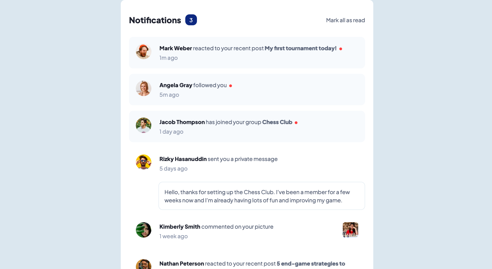

# Frontend Mentor - Notifications page solution

This is a solution to the [Notifications page challenge on Frontend Mentor](https://www.frontendmentor.io/challenges/notifications-page-DqK5QAmKbC).

## Table of contents

-  [Overview](#overview)
   -  [The challenge](#the-challenge)
   -  [Screenshot](#screenshot)
   -  [Links](#links)
-  [My process](#my-process)
   -  [Built with](#built-with)
   -  [What I learned](#what-i-learned)
   -  [Continued development](#continued-development)
-  [Author](#author)

## Overview

### Requirements

Users should be able to:

-  Distinguish between "unread" and "read" notifications
-  Select "Mark all as read" to toggle the visual state of the unread notifications and set the number of unread messages to zero
-  View the optimal layout for the interface depending on their device's screen size
-  See hover and focus states for all interactive elements on the page

### Screenshot

### Links

-  Solution URL: [Github Repository](https://github.com/jacksonwhiting/notifications-page)
-  Live Site URL: [Live Site](https://jw-notifications-page.netlify.app/)

## My process

### Built with

-  Semantic HTML5 markup
-  CSS custom properties
-  Flexbox
-  CSS Grid
-  Mobile-first workflow
-  Tailwind CSS
-  Vanilla Javscript

### What I learned

I used this as an opportunity to work on loading content via javascript. I built a data object and loaded all the dom elements using javascript and looping through the data object (as if it was pulled in via an API).

### Continued development

I'd like to figure out how to load a template while the javascript is loading to prevent getting an empty notifications page flicker (before the javascript loads)

## Author

-  Frontend Mentor - [@jacksonwhiting](https://www.frontendmentor.io/profile/jacksonwhiting)
-  Twitter - [@JWhiting00](https://www.twitter.com/JWhiting0)
